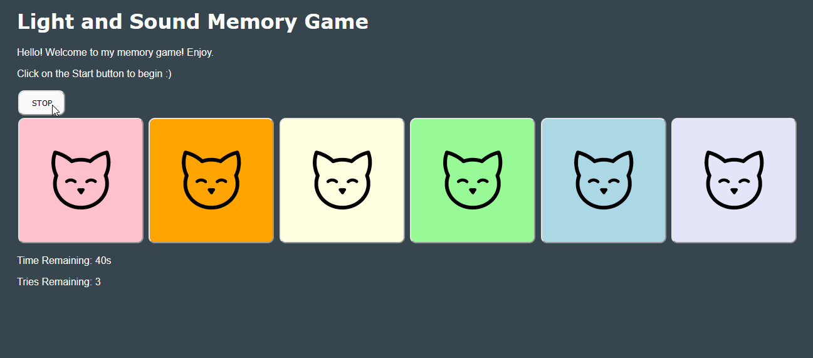

# Pre-work - *Memory Game*

**Memory Game** is a Light & Sound Memory game to apply for CodePath's SITE Program. 

Submitted by: **Dewan Tahmid**

Time spent: **8** hours spent in total

Link to website: https://uncovered-catnip-mousepad.glitch.me
Link to project: https://glitch.com/edit/#!/uncovered-catnip-mousepad

## Required Functionality

The following **required** functionality is complete:

* [x] Game interface has a heading (h1 tag), a line of body text (p tag), and four buttons that match the demo app
* [x] "Start" button toggles between "Start" and "Stop" when clicked. 
* [x] Game buttons each light up and play a sound when clicked. 
* [x] Computer plays back sequence of clues including sound and visual cue for each button
* [x] Play progresses to the next turn (the user gets the next step in the pattern) after a correct guess. 
* [x] User wins the game after guessing a complete pattern
* [x] User loses the game after an incorrect guess

The following **optional** features are implemented:

* [x] Any HTML page elements (including game buttons) has been styled differently than in the tutorial
* [ ] Buttons use a pitch (frequency) other than the ones in the tutorial
* [x] More than 4 functional game buttons
* [x] Playback speeds up on each turn
* [x] Computer picks a different pattern each time the game is played
* [x] Player only loses after 3 mistakes (instead of on the first mistake)
* [ ] Game button appearance change goes beyond color (e.g. add an image)
* [ ] Game button sound is more complex than a single tone (e.g. an audio file, a chord, a sequence of multiple tones)
* [x] User has a limited amount of time to enter their guess on each turn

The following **additional** features are implemented:

- [x] Game button has a cute cat on the top of it always
- [x] The 2 additional game buttons have a different sound

## Video Walkthrough

Here's a walkthrough of implemented user stories:

## Reflection Questions
1. If you used any outside resources to help complete your submission (websites, books, people, etc) list them here. 
> I used w3schools.com to help me figure out how to put an image on my button 
and htmlcolorcodes.com to help me pick and choose colors I liked and developer.mozilla.org/en-US/docs/Web/API/
to look up clearInterval() and setTimeout() for my timer.

2. What was a challenge you encountered in creating this submission (be specific)? How did you overcome it? (recommended 200 - 400 words) 
> The most challenging part of this assignment was trying to figure out how to 
handle the logic for the difficulty of the game. One of the optionals for this 
game was to give the player 3 strikes as well as a timer. Figuring out the logic 
of the timer and the 3 strikes in a way that felt fair for the user was the most 
challenging part of this game. I chose a global timer that would scale with how 
many buttons there were. For 6 buttons, the user would have 40 seconds total to 
finish the game. My issue was that the timer would continue to play while the 
sequence was taking its time. Thus, I had to make sure the timer paused while 
the sequence was playing. After I rereviewed how to use setTimeout() and clear
Interval() from MDN Web Docs, I changed the logic of my code so that the timer 
stops right before the sequence was playing and resumed after the whole sequence 
has played using a delay. This shortened the timer code to be in only 1 function, 
playClueSequence(), rather than in many of the if blocks inside the guess() 
function. This made my code easier to read and use if a developer was to use this 
in the future. I also had to figure out the logic inside decrementTimer() to 
visually show the user that when the timer stopped, it meant that only 1 life 
would be lost rather than the whole game. This meant that I had to visually show 
“0s”, decrement the life counter, and give the user more time after they lost a 
life due to time.

3. What questions about web development do you have after completing your submission? (recommended 100 - 300 words) 
> I found myself repeating a lot of code in my ccs and html. As an example, all 
of my buttons inside the game area had the same sticker of a cute cat and I found 
myself copying and pasting the same button code to add more buttons with the same 
sticker for one of the optionals for this game. I wonder if there is a way for 
there to be variables in html and css. I would love to change all of the text 
colors in my css file by editing a single constant rather than finding where I 
used the same color/element. Another question I have is about our JavaScript 
file. All of our logic was in a single file. I do not know a lot of JavaScript 
and I know that it is not related to Java, but I wonder if there is a way to make 
it object orientated like Java is. In other words, I would have liked to separate 
the sounds, buttons, game logic, and timer into separate classes or at least files 
to better organize my files. I also wonder how to handle our website for mobile 
users or unconventional screen sizes. Ideally, our button sizes and UI would be 
smaller for mobile users but I wonder what the best way of doing that is. How would
I ensure that my website works for all users with different browsers and devices? 
I want to explore and learn more about html, css, JavaScript, and web development 
in general.

4. If you had a few more hours to work on this project, what would you spend them doing (for example: refactoring certain functions, adding additional features, etc). Be specific. (recommended 100 - 300 words) 
> I would add a lot more features in the game in a settings tab. The tab could 
have general things such as a volume slider for the sound of the buttons and 
background music in the game. The user could also potentially choose different 
“stickers” or playing sounds for their buttons. I would also allow the user to 
choose how many buttons they would like as well as how much time and many lives 
they want. There would be special modes with leaderboards depending on how 
difficult the user makes their game. For example, putting the slider to max for 
time and the min for lives would activate an endless mode where the users have 
only 1 life to see how far they can go. This leaderboard would be sorted by 
region and there would be multiple based on these settings. To improve the feel 
of the game, I would like to show the time remaining as a progress bar that 
slowly goes down and arrange the buttons nicely in a rectangle so that it is 
friendlier for mobile users so that they do not have to scroll all the way down.

## License

    Copyright Dewan Tahmid

    Licensed under the Apache License, Version 2.0 (the "License");
    you may not use this file except in compliance with the License.
    You may obtain a copy of the License at

        http://www.apache.org/licenses/LICENSE-2.0

    Unless required by applicable law or agreed to in writing, software
    distributed under the License is distributed on an "AS IS" BASIS,
    WITHOUT WARRANTIES OR CONDITIONS OF ANY KIND, either express or implied.
    See the License for the specific language governing permissions and
    limitations under the License.